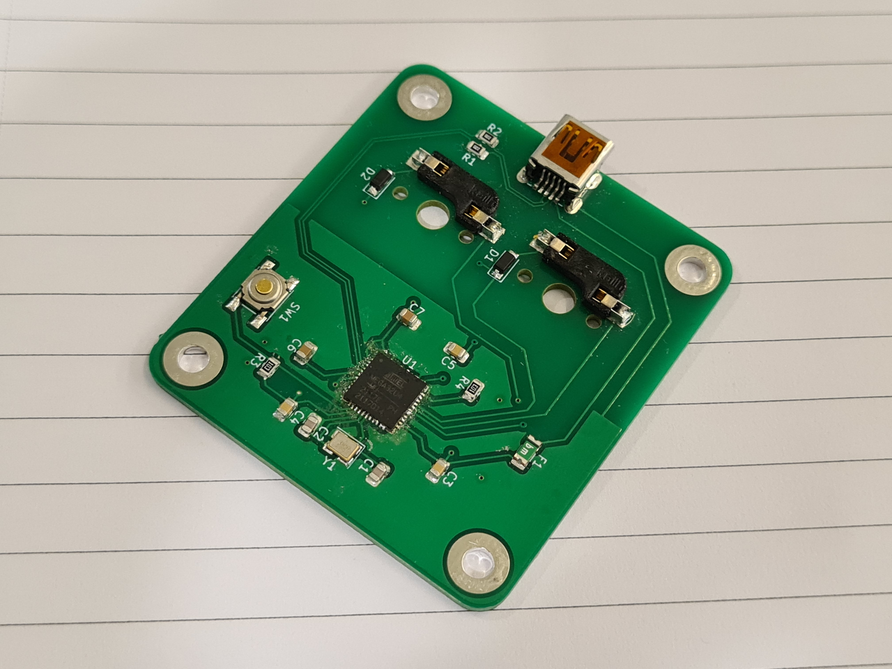

# Overview
This repo contains PCB designs, firmare and case designs for a variety of keypads designed primarily for the ATMEGA series of MCUs.

Made possible with help from ai03's excellent PCB design resource available at https://wiki.ai03.com/books/pcb-design
